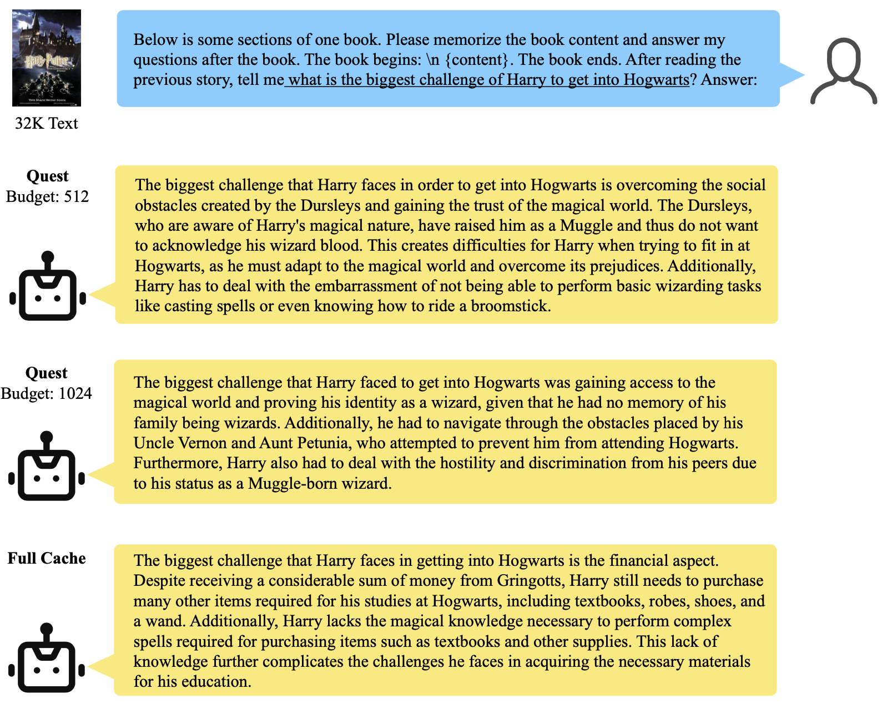

# Quest: Query-Aware Sparsity for Efficient Long-Context LLM Inference

[[paper](https://arxiv.org/abs/2406.10774)] [[poster](./assets/quest_poster.pdf)] [[slides](./assets/quest_slides.pdf)]


## TL;DR
Quest is an efficient long-context LLM inference framework that leverages **query-aware sparsity** in KV cache to reduce memory movement during attention and thus boost throughput. 

## Abstract
As the demand for long-context large language models (LLMs) increases, models with context windows of up to 128k or 1M tokens are becoming increasingly prevalent. However, long-context LLM inference is challenging since the inference speed decreases significantly as the sequence length grows. This slowdown is primarily caused by loading a large KV cache during self-attention. Previous works have shown that a small portion of critical tokens will dominate the attention outcomes. However, we observe the criticality of a token highly depends on the query. 

To this end, we propose Quest, a query-aware token criticality estimation algorithm. Quest keeps track of the minimal and maximal Key values in KV cache pages and estimates the criticality of a given page using Query vectors. By only loading the Top-K critical KV cache pages for attention, Quest significantly speeds up self-attention without sacrificing accuracy. We show that Quest can achieve up to 7.03× self-attention speedup, which reduces inference latency by 2.23× while performing well on tasks with long dependencies with negligible accuracy loss.

## Installation
1. Clone this repo (also clone submodules)
```
git clone --recurse-submodules https://github.com/mit-han-lab/quest
cd quest
```
2. Install dependency libraries
```
conda create -yn quest python=3.10
conda activate quest
pip install -e . && pip install flash-attn==2.3.0 --no-build-isolation

# Install CMake (with version >= 3.26.4)
conda install cmake

# build libraft
cd kernels/3rdparty/raft
./build.sh libraft
```
3. Compile kernel benchmarks (Optional). Remember to configure env variables for CUDA (Check the [tutorial](https://faculty.cc.gatech.edu/~hyesoon/spr09/installcuda.html)).
```
cd kernels
mkdir build && cd build
cmake ..
make -j
```
4. Build end-to-end operators with PyBind
```
# This will automatically build and link the operators
cd quest/ops
bash setup.sh
```
## Accuracy Evaluation
Our evaluations are based on [LongChat-7B-v1.5-32K](https://huggingface.co/lmsys/longchat-7b-v1.5-32k?clone=true) and [Yarn-Llama2-7B-128K](https://huggingface.co/NousResearch/Yarn-Llama-2-7b-128k) models, which are capable of handling long-context text generations. We evaluate both passkey retrieval and LongBench benchmarks. We provide several scripts to reproduce our results in the paper:

To get the Passkey Retrieval results, please modify and execute:
```
bash scripts/passkey.sh
```

To reproduce the LongBench results, please modify and execute:
```
bash scripts/longbench.sh
```

To evaluate the perplexity result of PG-19, please execute:
```
bash scripts/ppl_eval.sh
```

## Efficiency Evaluation
Kernels and end-to-end effiency are evaluated on NVIDIA Ada6000 and RTX4090 GPUs with CUDA version of 12.4. We provide several scripts to reproduce our results in the paper:

### Kernel-level Efficiency
We also release the unit tests and benchmarks used for kernel implementations. Correctness of kernel is verified by unit tests in `kernels/src/test`, while performance is evaluated by NVBench in `kernels/src/bench`. We also test the correctness of PyBind operators in `quest/tests` with PyTorch results via PyTest.

To test the correctness of kernels, please execute:
```
cd kernels/build
./test_batch_decode # or any other operator
```
Or utilize PyTest:
```
cd quest/tests
PYTHONPATH=$PYTHONPATH:../../ pytest
```
To reproduce the kernel performance shown in paper, please execute:
```
cd kernels/build
./bench_batch_decode -a seqlen=4096 -a page_budget=[64,512]
# or any other operator
```
With sample output:


### End-to-end Efficiency

Quest can achieve up to 2.23× end-to-end speedup while performing well on tasks with long dependencies with negligible accuracy loss:


We incorporate all implemented operators into a full pipeline to evaluate the end-to-end efficiency in text generations. Based on the [Huggingface Transformers](https://github.com/huggingface/transformers/blob/main/src/transformers/models/llama/modeling_llama.py), we enable a KV-Cache manager which supports query-aware sparsity as shown in `quest/models/QuestAttention.py`.

To reproduce the end-to-end efficiency results in Figure.10, please execute:
```
bash scripts/bench_efficiency_e2e.sh
```

For the qualitative analysis of baselines, we use FlashInfer kernel to estimate the performance of H2O and TOVA. To reproduce the results in Figure.11, please execute:
```
bash scripts/bench_kernels.sh
```

## Examples
We provide several examples to demonstrate the usage of Quest. These examples are implemented with the end-to-end integration of Quest operators, and can be executed with the following commands (please make sure you have setup all the operators):
```
python3 scripts/example_textgen.py
```
With example output of long-context summarization under LongChat-7B-v1.5-32K model:


You can also try `scripts/example_demo.py` to test the performance of Quest on your own text generation tasks. We provide a simple interface to load the model and generate text with Quest operators. The above demo is an example with 32K input on FP16 LongChat-7B-v1.5-32K. Quest with 2048 token budget achieves 1.7x speedup compared to full cache FlashInfer version.

## TODOs

- [ ] Support GQA models

## Reference
If you find this project is helpful to your research, please consider to cite our paper:
```
@misc{tang2024quest,
      title={Quest: Query-Aware Sparsity for Efficient Long-Context LLM Inference}, 
      author={Jiaming Tang and Yilong Zhao and Kan Zhu and Guangxuan Xiao and Baris Kasikci and Song Han},
      year={2024},
      eprint={2406.10774},
      archivePrefix={arXiv},
      primaryClass={id='cs.CL' full_name='Computation and Language' is_active=True alt_name='cmp-lg' in_archive='cs' is_general=False description='Covers natural language processing. Roughly includes material in ACM Subject Class I.2.7. Note that work on artificial languages (programming languages, logics, formal systems) that does not explicitly address natural-language issues broadly construed (natural-language processing, computational linguistics, speech, text retrieval, etc.) is not appropriate for this area.'}
}
```

## Related Projects

This codebase utilizes [lm_eval](https://github.com/EleutherAI/lm-evaluation-harness.git) to evaluate perplexity and zero-shot accuracy. It also adapts code snippets from [H2O](https://github.com/FMInference/H2O), [StreamingLLM](https://github.com/mit-han-lab/streaming-llm) and [Punica](https://github.com/punica-ai/punica). Our kernels are implemented based on [FlashInfer](https://github.com/flashinfer-ai/flashinfer) (a performant and extensible kernel library for LLM serving) and tested by [NVBench](https://github.com/NVIDIA/nvbench/tree/main). Thanks for the great works from our community!


[H2O: Heavy-Hitter Oracle for Efficient Generative Inference of Large Language Models](https://github.com/FMInference/H2O)

[TOVA: Transformers are Multi-State RNNs](https://github.com/schwartz-lab-NLP/TOVA)

[StreamingLLM: Efficient Streaming Language Models with Attention Sinks](https://github.com/mit-han-lab/streaming-llm)

[AWQ: Activation-aware Weight Quantization for LLM Compression and Acceleration](https://github.com/mit-han-lab/llm-awq/)